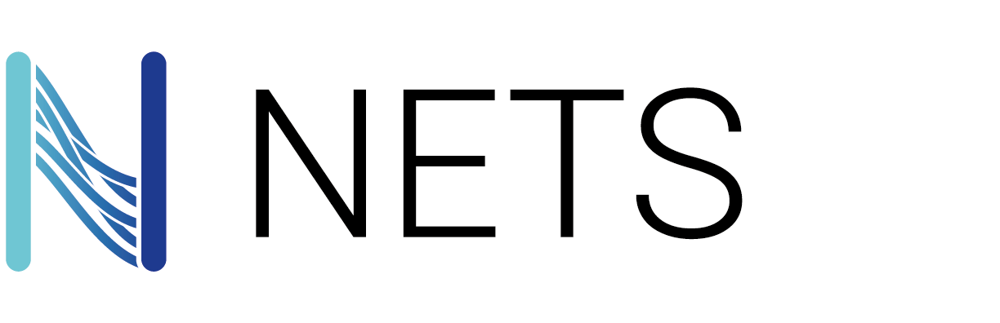

[](https://pypi.org/project/nets/)
[](https://pypi.org/project/nets/)
[](https://arthurdjn.github.io/nets/)
[](https://arthurdujardin.com/projects/nets.html)



# 1. Table of Content

<!-- TOC -->

- [1. Table of Content](#1-table-of-content)
- [2. Overview](#2-overview)
    - [2.1. About](#21-about)
    - [2.2. Requirements](#22-requirements)
    - [2.3. Installation](#23-installation)
- [3. Status](#3-status)
- [4. Documentation](#4-documentation)
- [5. Get Started](#5-get-started)
    - [5.1. Computational Graph](#51-computational-graph)
    - [5.2. Building a model](#52-building-a-model)
- [6. Notebooks](#6-notebooks)
- [7. References](#7-references)

<!-- /TOC -->

# 2. Overview

## 2.1. About

**NETS** is a light-weight Deep Learning **Python** package, made using only (mostly) **numpy**.
This project was first introduced as an assignment at the
[University of Oslo](https://www.uio.no/studier/emner/matnat/ifi/IN5400/), which is similar to the second
assignment from [Stanford University](http://cs231n.stanford.edu/syllabus.html).

However, this project was pushed further to make it _OOP_ with an easier API.
In addition, the back-propagation and update rules where changed, using a custom **autograd** system.
**NETS** was highly inspired from [PyTorch](https://pytorch.org/) and [TensorFlow](https://www.tensorflow.org/)
packages.

### But why ?

**NETS** package has **NO CLAIMS** to shadow already well build deep learning packages like **PyTorch**
or **TensorFlow**. Instead, this package was made to understand how all of these libraries work and handle
forward / backward propagation by making one from scratch.
As I am going through this _deep_ understanding, I found interesting to share
as much as possible my work, which I hope will help students or people who want to learn more about this subject.

## 2.2. Requirements

All packages within **NETS** are made from scratch, using mainly **numpy**. However, some additional
packages can offer a better experience if installed (saving checkpoints and models for example).

-   **numpy**
-   **json** (Optional)
-   **time** (Optional)
-   **pandas** (Optional)
-   **scipy** (Optional)
-   **sklearn** (Optional)

## 2.3. Installation

To install this package from [PyPi](https://pypi.org)

```css
$ pip install nets
```

or from this repository

```css
$ git clone https://github.com/arthurdjn/nets
$ cd nets
$ pip install .
```

# 3. Status

| Development                  | Status      | Feature                                                                |
| ---------------------------- | ----------- | ---------------------------------------------------------------------- |
| Autograd System              | finished    | <ul><li>[x] Tensor</li><li>[x] Parameter</li></ul>                     |
| Optimization                 | finished    | <ul><li>[x] SGD</li><li>[x] Adam</li><li>[x] RMSprop</li></ul>         |
| Loss                         | in progress | <ul><li>[x] MSE</li><li>[x] Cross Entropy</li><li>[ ] BCE</li></ul>    |
| Solver                       | finished    | <ul><li>[x] Train</li><li>[x] Eval</li><li>[x] Checkpoints</li></ul>   |
| Data                         | finished    | <ul><li>[x] Dataset</li><li>[x] Batch</li><li>[x] Iterator</li></ul>   |
| Dense Neural Network         | finished    | <ul><li>[x] Linear</li><li>[x] Sequential</li></ul>                    |
| Convolutional Neural Network | finished    | <ul><li>[x] Conv2d</li><li>[x] MaxPool2d</li><li>[x] Dropout</li></ul> |
| Recurrent Neural Network     | in progress | <ul><li>[x] RNN</li><li>[ ] LSTM</li><li>[ ] GRU</li></ul>             |

# 4. Documentation

The documentation and tutorials are in process and will be released soon.
You will find some tutorials and application on how to get started or build a similar package.

# 5. Get Started

**NETS** architecture follows the one from **PyTorch**.
It provides a basic neural network structure so you can create your own with numpy. You will need to
wrap your arrays in a `Tensor` class to keep track of the gradients, just like in **PyTorch**.


## 5.1. Computational Graph

**NETS** uses a forward & backward pass for gradient descent optimizations (NOTE: there are now other optimizers !).

You can also uses the autograd system (recommended). It behaves similarly as Pytorch, except it is entirely done with NumPy.

```python
import nets


t1 = nets.Tensor([1, 2, 3], require_grad=True)
t2 = nets.Tensor([4, 5, 6])

t3 = t1 + t2  
# t3 now requires gradient
t3 = t3.sum()
# Compute the gradients for t1
t3.backward()
```

## 5.2. Building a model

A model is a `Module`subclass, where biases, weights and parameters transformations are computed.
All modules have a `forward` method, that MUST be overwritten.
This method will compute the forward propagation from an input tensor, and compute the transformation.
If using the `autograd` system, no back-propagation need to be added. However,
if you prefer to manually compute the gradients, you will need to override the `backward` method.

Your `Model` should inherits from the `Module` class and override
the `forward` method.

```python
import nets
import nets.nn as nn

class Model(nn.Module):
    """
    Create your own model.
    The attributes should be your submodels used during the forward pass.
    You don't have to necessary affect the activation function as an attribute,
    unless you want to set a manual backward pass.
    """
    def __init__(self, input_dim, hidden_dim, output_dim):
        # Initialization
        super().__init__() # Don't forget to add this line
        self.layer1 = nn.Linear(input_dim, hidden_dim)
        self.layer2 = nn.Linear(hidden_dim, hidden_dim)
        self.layer3 = nn.Linear(hidden_dim, output_dim)

    def forward(self, inputs):
        # Forward pass
        out1 = nets.tanh(self.layer1(inputs))
        out2 = nets.tanh(self.layer2(out1))
        return self.layer3(out2)

model = Model(10, 100, 2)

# Let's check the architecture
model
```

Out:

```pycon
Model(
   (layer1): Linear(input_dim=10, output_dim=100, bias=True)
   (layer2): Linear(input_dim=100, output_dim=100, bias=True)
   (layer3): Linear(input_dim=100, output_dim=2, bias=True)
)
```

Again, this is really similar to what **PyTorch** offers.

# 6. Notebooks

-   0 - [Getting Started with NETS](examples/notebooks/0_Getting_Started_with_NETS.ipynb)

    This tutorial highlights the main part and modules of **NETS**.

-   1 - [Build an Autograd System with NumPy]()

    To be released

-   2 - [Build a Feed Forward Neural Network with NumPy](examples/notebooks/1_Image_Classifier_with_PyTorch.ipynb)

    Build a Fully Connected Neural Network for image classification.

-   3 - [Build a Convolutional Neural Network with NumPy](examples/notebooks/2_Build_a_CNN_with_NETS.ipynb)

    Build a Convolutional Neural Network for image classification.

# 7. References

Here is a list of tutorials and lectures/assignment that helped to develop **NETS**

-   [PyTorch documentation](https://pytorch.org)
-   [PyTorch autograd tutorial](https://pytorch.org/tutorials/beginner/blitz/autograd_tutorial.html)
-   [Joel Grus autograd tutorial](https://github.com/joelgrus/autograd/tree/part06)
-   [Joel Grus autograd live coding](https://www.youtube.com/watch?v=RxmBukb-Om4)
-   [Stanford University cs231n 2nd assignment](http://cs231n.github.io/)
-   [University of Oslo in5400 1st assignment](https://www.uio.no/studier/emner/matnat/ifi/IN5400/)
