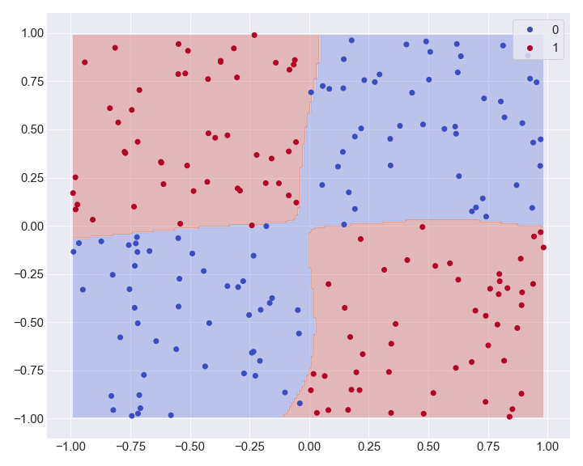

**NETS** is a Python package for deep learning application and networks construction
from scratch using **numpy**
and an autograd system (you can switch to vanilla gradient update too).


# Get Started

### About
**NETS** is a vanilla Deep Learning framework, made using only **numpy**.
This project was first introduced as an assignment I made at the 
[University of Oslo](https://www.uio.no/studier/emner/matnat/ifi/IN5400/), which is similar to the second
assignment from [Stanford University](http://cs231n.stanford.edu/syllabus.html).

However, this project was rebuild to make it entirely *object-oriented like*.
Moreover, the back-propagation and update rules where changed, using the **autograd** system.
**NETS** was highly inspired from [PyTorch](https://pytorch.org/) and [TensorFlow](https://www.tensorflow.org/)

### Requirements

All packages within **NETS** are made from scratch, using mainly **numpy**. However, some additional 
packages can offer a better experience if installed (saving checkpoints and models for example).

- **numpy**
- **json** (Optional)
- **time** (Optional)
- **pandas** (Optional)
- **scipy** (Optional)
- **sklearn** (Optional)

### Installation

To install this package from [PyPi](https://pypi.org)

````css
$ pip install nets
````

or from this repository
````css
$ git clone https://github.com/arthurdjn/nets
$ cd nets
$ pip install .
````

### Documentation

The documentation and tutorials are in process and will be released soon. 
You will find some tutorials and application on how to get started or build a similar package.

# Example

**NETS** provides a basic neural network structure so you can create your own with numpy. You will need to
wrap your arrays in a ``Tensor`` class to keep track of the gradients.



## Building a model

A model is a ``Module``subclass, where biases, weights and parameters transformations are computed.
All modules have a ``forward`` method, that MUST be overwritten. 
This method will compute the forward propagation from an input tensor, and compute the transformation. 
If using the ``autograd`` system, no back-propagation need to be added. However, 
if you prefer to manually compute the gradients, you will need to override the ``backward`` method.

Your ``Model`` should inherits from the ``Module`` class and override
the ``forward`` method.

````python
import nets
import nets.nn as nn

class Model(nn.Module):
    """
    Create your own model.
    The attributes should be your submodels used during the forward pass.
    You don't have to necessary affect the activation function as an attribute, 
    unless you want to set a manual backward pass.
    """
    def __init__(self, input_dim, hidden_dim, output_dim):
        # Initialization
        super().__init__() # Don't forget to add this line
        self.layer1 = nn.Linear(input_dim, hidden_dim)
        self.layer2 = nn.Linear(hidden_dim, hidden_dim)
        self.layer3 = nn.Linear(hidden_dim, output_dim)
        
    def forward(self, inputs):
        # Forward pass
        out1 = nets.tanh(self.layer1(inputs))
        out2 = nets.tanh(self.layer2(out1))
        return self.layer3(out2)
    
model = Model(10, 100, 2)

# Let's check the architecture
model
````

Out:
````pycon
Model(
   (layer1): Linear(input_dim=10, output_dim=100, bias=True)
   (layer2): Linear(input_dim=100, output_dim=100, bias=True)
   (layer3): Linear(input_dim=100, output_dim=5, bias=True)
)
````

Again, this is really similar to what **PyTorch** offers.